### 运输层协议概述
#### 进程之间的通信
1. 运输层的重要功能：复用和分用
- **复用**: 应用层所有的应用进程都可以通过运输层再传送到IP层
- **分用**: 运输层从IP层收到数据后必须交付给指明的应用进程

2. 网络层与运输层的区别
- **网络层**: 为主机之间提供逻辑通信
- **运输层**: 为应用进程之间提供端到端的逻辑通信

#### 运输层的端口（软件端口）
> 给应用层的每个应用进程赋予一个明确的标志

1. 服务器端使用的端口号
- **熟知端口号（系统端口号）**：0~1023,指派给了TCP/IP最重要的一些应用程序
- **登记端口号**: 1024~49151
2. 客户端使用的端口号
- 又叫 **短暂端口号** ,49152~65535，仅在客户进程运行时动态选择

### 用户数据报协议UDP
> 在IP的数据服务上加了复用和分用，差错检测的功能

#### 主要特点
- **UDP是无连接的**: 发送数据之前不需要建立连接
- **UDP使用尽最大努力交付**
- **UDP是面向报文的**: 应用层交给UDP多长的报文，UDP就照样发送，即一次发送一个报文
- **UDP没有拥塞控制**: 因此网络出现的拥塞不会使源主机的发送速率降低 
- **UDP支持一对一、一对多、多对一和多对多的交互通信**
- **UDP的首部开销小**:只要8个字节

#### UDP的首部格式
> 四个字段，每个字段两个字节

- 源端口
- 目的端口
- 长度
- 检验和
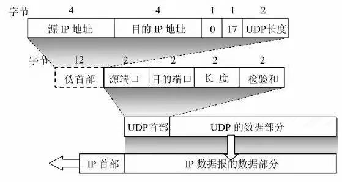

----

### 传输控制协议TCP
#### 概述
1. 主要特点
- **TCP是面向链接的运输层协议**: 使用之前，必须建立连接；数据传输完毕之后，必须释放已经建立的连接
- **每一条TCP连接只能有两个端点**: 点对点（一对一）
- **TCP提供可靠交付的服务**: 无差错、不丢失、不重复，按序到达
- **TCP提供全双工通信**: 允许通信双方的应用进程在任何时候都很高发送数据。发送时，应用程序在把数据传送给TCP的缓存之后就可以做自己的事，然后TCP在合适的时候把数据发送出去；接收时，TCP把收到的数据放入缓存，上层的应用进程在合适的时候读取缓存中的数据
- **面向字节流**: 应用程序和TCP的交互是一次一个数据块（大小不等），但TCP把应用程序叫下俩的而数据看成仅仅是一连串的无结构的字节流
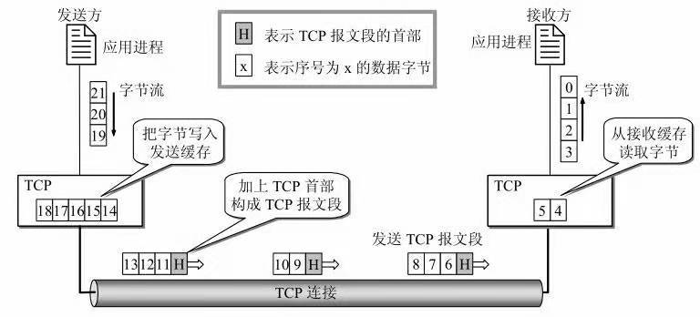

2. TCP的连接
- TCP连接的端点叫做套接字或插口
- 端口号拼接到IP地址构成了套接字
- 每一条TCP连接唯一地被通信两端的两个端点所确定
- 同一个IP地址可以有多个不同的TCP链接，而同一个端口号也可以出现在多个不同的TCP连接

#### 可靠传输的工作原理
##### 停止等待协议
> ”停止等待“就是每发送完一个分组就停止发送，等待对方的确认，在收到确认后再发送下一个分组

1. 无差错情况
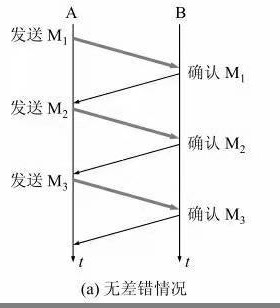
2. 出现差错(超时重传)
> 发送方只要超过了一段时间仍然没有收到确认，就认为刚才发送的分组丢失了，因而重传前面发送过的分组

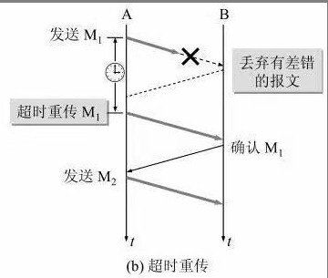
三点注意：
- 发送方发送完一个分组后，必须暂时保留已发送的分组的副本（超时重传时使用）,收到确认后才可以清除副本。
- 分组和确认分组都必须编号（才能明确是哪一个发送出去的分组收到了确认）
- 重传时间应当比数据在分组传输的平均往返时间更长一些
3. 确认丢失和确认迟到
- **确认丢失**: 接收方发送的对分组的确认丢失了
    当接收方又收到重传的分组时（发送方没有收到确认信息会重传），采取两个行动：
    i. 丢弃这个重复的分组
    ii. 向发送方发送确认
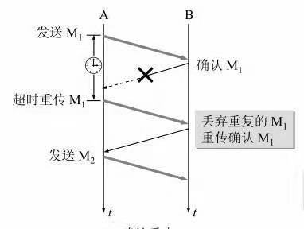
- **确认迟到**: 传输过程没有差错，但接收方对分组的确认迟到了
    i. 发送方会收到重复的确认，收下后丢弃；
    ii. 接收方会收到重复的分组， 同样丢弃，并重传确认分组
4. 信道利用率
信道利用率计算：

> 当往返时间RTT远大于分组发送时间Td时，信道的利用率会非常低，因而需要采用流水线传输

##### 连续ARQ协议
- 发送方维持一个发送窗口，位于发送窗口内的分组可以连续发送出去，不需要等待对方的确认
- 发送方每收到一个一个确认，就把发送窗口向前滑动一个分组的位置
- 接收方一般采用累积确认的方式，接收方不必对收到的分组逐个发送确认，而是在收到几个分组后对按序到达的最后一个分组发送确认，这表示：到这个分组为止的素有分组都已正确收到了
- 优点： 容易实现，确认丢失也不必重传
- 缺点： 不能正确反映出接收方已经正确收到的所有分组的信息，比如5个中的第3个丢了，就只能对前两个分组发出确认，后面三个重传

#### TCP报文段的首部格式
> TCP的全部功能都体现在它首部中各字段的作用

- **源端口和目的端口**: 
- **序号**: 范围[0, 2^32 - 1],序号增加到2^32 - 1后，下一个序号又回到0。在一个TCP连接中传送的字节流中的每一个字节都按顺序编号
- **确认号**: 期望收到对方下一个报文段的第一个数据字节的序号，若确认号=N,则表明：到序号N-1为止的所有数据都已正确收到
- **数据偏移**: 单位是4个字节，指出TCP报文段的数据起始处距离TCP报文段的起始处有多远，这个字段实际上是指出TCP报文段的首部长度
- **保留**: 保留为今后用，目前应置为0
- **紧急URG**: 当URG=1时，表示文段中有紧急数据，发送应用进程告诉发送方的TCP有紧急数据要传送，发送方TCP就把紧急数据插入到被报文段的最前面，要与紧急指针字段配合使用
- **确认ACK**: 在TCP连接建立后所有传送的报文都必须把ACK置1
- **推送PSH**: 发送方TCP把PSH置为1时，立即创建一个报文段发送出去，接收方尽快地交付接收应用进程，不用等到缓存填满
- **复位RST**: 当RST=1时，表明TCP连接中出现严重差错，必须释放连接，然后再重新建立运输连接
- **同步SYN**: 在连接建立事用来同步序号
- **终止FIN**: 用来释放一个连接
- **窗口**: 指的是发送本报文段的一方的接收窗口。窗口值告诉对方：从本报文段首部中的确认号算起，接收方目前允许对方发送的数据量
- **校验和**: 计算方法和UDP一样
- **紧急指针**: 当URG=1时才有意义，支出本报文段中的紧急数据的字节数
- **选项**: 长度可变，最长达40字节

#### TCP可靠传输的实现
1.以字节为单位的滑动窗口
- TCP的滑动窗口以字节为单位
- 发送窗口里面的序号表示允许发送出去的序号
- 如图，假定A收到B发来的确认报文段，其中窗口是20，确认窗口是31，表明B期望收到的下一个序号是31,30为止的数据已经收到了

- 凡是已经发送过的数据，在未收到确认之前都必须暂时保留，以便超时重传
- 描述一个发送窗口的状态需要三个指针，如图：

- 发送缓存用来暂时存放：
    i. 发送应用程序传送给发送方TCP准备发送的数据；
    ii. TCP已发送出但尚未收到确认的数据；
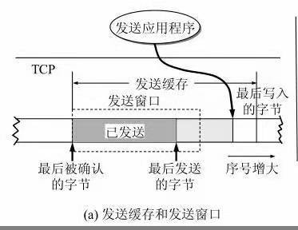tcp_recieve_cahce
- 接收缓存用来暂时存放：
    i. 按序到达的、但尚未被接收应用程序读取的数据；
    ii. 未按序到达的数据；
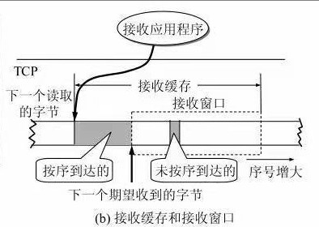

- 三点强调：
    i. 发送窗口并不总是和接收窗口一样大
    ii. 对于不按序到达的数据，先临时存放在接收窗口中，等到字节流中所缺少的字节收到后，再按序交付上层的应用进程
    iii. TCP要求接收方必须有累积确认的功能 
    
2.超时重传时间的选择
RTTs（加权平均往返时间）计算：

RTTd（RTT的偏差的加权平均值）计算：

RTO（超时重传时间）：

3.选择确认SACK
> 用来解决只传送缺少的数据而不重传已经正确到达接收方的数据

#### TCP的流量控制

> 流量控制：让发送方的发送速率不要太快，要让接收方来得及接收。

1. 利用滑动窗口实现流量控制
> 发送方的发送窗口不能超过接收方给出的接收窗口的数值

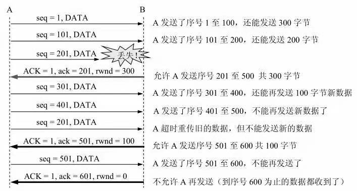
2. 传输效率
三种控制TCP报文段发送时机的机制:
- 维持一个变量，等于最大报文段长度MSS
- 发送方的应有进程指明要求发送报文段，即推送(push)操作
- 发送方的计时器期限
 
#### TCP的拥塞控制
1. 拥塞控制的一般原理
两种方法：
- 开环控制：在设计网络时事先将有关发送拥塞的因素考虑周到，力求网络在工作时不发生拥塞，但系统运行起来中途不能改正
- 闭环控制：三种措施：
    i. 检测网络系统以便检测到拥塞何时、何处发生；
    ii. 把拥塞发送的信息传送到可采取行动的地方；
    iii. 调整网络系统的运行以解决问题；
2. 四种拥塞控制方法
**慢开始和拥塞避免**：发送方维持一个叫做拥塞窗口cwnd的状态变量，发送方让自己的发送窗口等于拥塞窗口；
- 慢开始：由小到大逐渐增大拥塞窗口数值（为了防止拥塞窗口cwnd增长过大引起网络拥塞，需要设置一个慢开始门限状态变量ssthresh）

- 拥塞避免：让拥塞窗口cwnd缓慢地增大，即每经过一个往返时间就把发送方的拥塞窗口加1（拥塞避免并非完全能够避免了拥塞）
慢开始和拥塞避免算法实现举例：
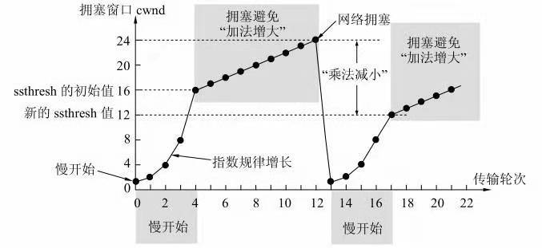
**快重传和快恢复**: 
- 快重传：发送方只要一连收到三个重复确认就应当立即重传对方尚未搜到的报文段，而不必继续等待重传计时器到期

- 快恢复：当发送方连续收到三个重复确认时，就执行“乘法减小”，把慢开始门限ssthresh减半（而不是直接设置cwnd为1），然后开始拥塞避免算法
快重传和快恢复算法实现举例：
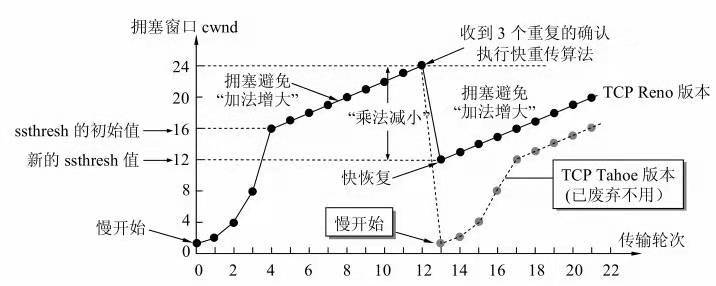
3. 随机早期检测RED
- 随机早起检测： 在检测到网络拥塞的早期征兆时，就以概率p随机丢弃个别的分组，让拥塞控制只在个别的TCP连接上进行，少量的分组被丢弃，避免发生全局性的拥塞控制
- 需要选择好三个参数：最小门限THmin，最大门限THmax和概率p
- 丢弃概率p与两个门限值的关系图：
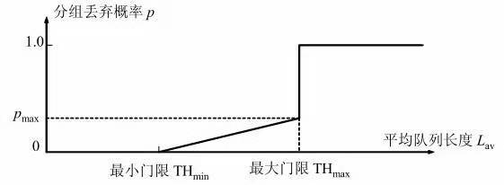

#### TCP的运输连接管理
> 运输连接有三个阶段：连接建立，数据传送，连接释放

1. TCP的连接建立：三次握手
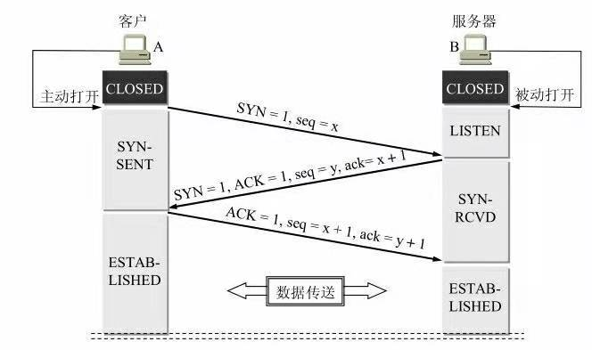
- **第一次握手**：客户进程A创建传输控制模块TCB，想服务进程发出连接请求报文段，等待B确认，这时A进入SYN-SENT（同步已发送）状态
> 报文段首部中SYN=1，同时选择一个初始序号seq=x，不携带任何数据，但要消耗一个序号

- **第二次握手**：服务进程B收到请求报文段后，如同意建立连接，则向A发送确认，这时TCP服务进程进入SYN-RCVD（同步已发送）状态
> 将SYN和ACK都置1，确认号是ack=x+1，同时也为自己选一个初始序列号seq=y

- **第三次握手**：A收到B的确认后，要想B给出确认，这时TCP连接已经建立，A进入ESTABLISHED（已建立连接）状态，当B收到A的确认后，也进入ESTABLISHED状态
> A发送的确认报文段ACK置1，确认号ack=y+1，自己的序号seq=x+1，ACK报文段可以携带数据，但不携带数据则不消耗序号。**A发送一次确认是为了防止已失效的拦截请求报文段突然有传到了B**

2. TCP的连接释放:四次挥手
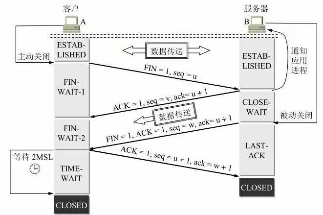
- **第一次挥手**：A向B发送释放连接报文段，A进入FIN-WAIT-1在（终止等待1）状态
> 报文段首部中终止控制位FIN置1，其序号是seq=u，等于前面已传送过的数据的最后一个自己的序号加1，即使不携带任何数据，但要消耗一个序号

- **第二次挥手**：B收到连接释放报文段后发出确认，B进入CLOSE-WAIT（关闭等待）状态，这时TCP连接处于半关闭状态，即A已经没有数据发送给B，但B若发送数据，A仍要接收。A收到确认之后，进入FIN-WAIT-2（终止等待2）状态
> 确认号是ack=u+1，这个报文号自身的序号是v,等于前面已传送过的数据的最后一个自己的序号加1

- **第三次挥手**：若B已经没有要想向A发送的数据，就通知TCP释放连接，B进入LAST-ACK（最后确认状态），等待A的确认
> B发出的报文段令FIN=1，而且必须重复上次已发送过的确认号ack=u+1

- **第四次挥手**：A收到B的连接释放报文段后，必须对此发出确认。然后A进入TIME-WAIT（时间等待）状态
> A发送的确认报文段ACK置1，确认号ack=w+1，自身的序号是seq=u+1。**注意这时TCP连接还没有释放掉，必须经过时间等待计时器设置的时间2MSL后，A才进入CLOSED状态。**

3. TCP的有限状态机
> 粗实线箭头表示对客户进程的正常变迁，粗虚线箭头表示对服务器进程的正常变迁，细线箭头表示异常变迁

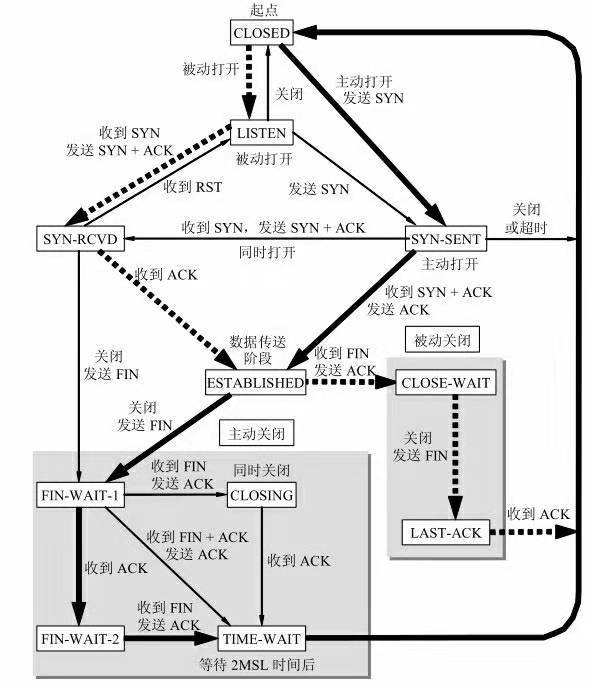

