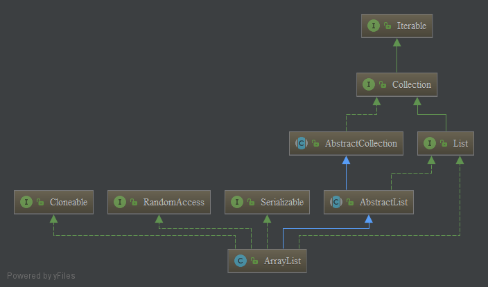

### 简介
- **数据结构**：基于数组，能够动态到地增加或减小其大小，当也可以调用ensureCapacity方法来进行人工地增加ArrayList的容量，从而避免再分配的消耗时间，前提是事先知道需要存储很多内容。
- **继承关系**：继承自AbstractList，实现了List、RandomAccess、Cloneable、Serializable接口。其类图如下：


- **空值**：允许 null 的存在。
- **线程安全性**：线程不安全。
---

### 相关域
```java
private static final long serialVersionUID = 8683452581122892189L;

private static final int DEFAULT_CAPACITY = 10;

private static final Object[] EMPTY_ELEMENTDATA = {};

private static final Object[] DEFAULTCAPACITY_EMPTY_ELEMENTDATA = {};

transient Object[] elementData; 

private int size;
```
- **serialVersionUID**: 序列号
- **DEFAULT_CAPACITY**: 默认初始化容量，默认为10
- **EMPTY_ELEMENTDATA**: 空数组，当用户指定ArrayList的容量为0时，返回该空数组
- **DEFAULTCAPACITY_EMPTY_ELEMENTDATA**: 空数组，当用户没有指定ArrayList的容量时，elementData将会引用此数组
- **elementData**: 用户存储数据的数组
- **size**: 当前ArrayList实际存储的数量数量

---

### 构造器
- **构造一个指定初始容量的ArrayList**

```java
public ArrayList(int initialCapacity) {
    if (initialCapacity > 0) {
        this.elementData = new Object[initialCapacity];
    } else if (initialCapacity == 0) {
        this.elementData = EMPTY_ELEMENTDATA;                  
    } else {
        throw new IllegalArgumentException("Illegal Capacity: " + initialCapacity);
    }
}
```
当初始化容量等于0时，返回EMPTY_ELEMENTDATA

- **构造一个默认容量的ArrayList**

```java
public ArrayList() {
    this.elementData = DEFAULTCAPACITY_EMPTY_ELEMENTDATA;
}
```
创建一个空的 ArrayList，此时其内数组elementData = {}, 长度为 0, 当元素第一次被加入时，扩容至默认容量 10

- **构造一个包含collection的ArrayList**：传入一个collection，其内元素将会全部添加到新建的ArrayList实例中


```java
public ArrayList(Collection<? extends E> c) {
    elementData = c.toArray();
    if ((size = elementData.length) != 0) {
        // c.toArray might (incorrectly) not return Object[] (see 6260652)        //1 
        if (elementData.getClass() != Object[].class)
            elementData = Arrays.copyOf(elementData, size, Object[].class);       //2
    } else {
        // replace with empty array.
        this.elementData = EMPTY_ELEMENTDATA;                                     //3
    }
}
```
1. c.toArray可能不会返回 Object[]，可以查看 java 官方编号为 6260652 的 bug
2. 若 c.toArray() 返回的数组类型不是 Object[]，则利用 Arrays.copyOf(); 来构造一个大小为 size 的 Object[] 数组
3. 若collection长度为0，则替换为空数组

---

### 自动扩容机制
- 因为扩容发生在添加元素时，首先看一下add()方法

```java
public boolean add(E e) {
    ensureCapacityInternal(size + 1);  
    elementData[size++] = e;
    return true;
}
```
这里调用了ensureCapacityInternal(size + 1),size + 1保证资源空间不被浪费，按当前情况，保证要存多少个元素，就只分配多少空间资源，这里后续会修改modCount的值，

- 看下ensureCapacityInternal方法

```java
private void ensureCapacityInternal(int minCapacity) {
    ensureExplicitCapacity(calculateCapacity(elementData, minCapacity));
}
```
这里计算了ArrayList当前合理的容量（即size+1)，

- 我们看下计算方式：calculateCapacity

```java
private static int calculateCapacity(Object[] elementData, int minCapacity) {   
    if (elementData == DEFAULTCAPACITY_EMPTY_ELEMENTDATA) {             //1
        return Math.max(DEFAULT_CAPACITY, minCapacity);                 //2
    }
    return minCapacity;
}
```
1. 一个私有静态方法，当用户没有指定ArrayList的容量时，构造器会将DEFAULTCAPACITY_EMPTY_ELEMENTDATA赋给elementData；
2. 当前合理的容量计算方式如下：
如果当前的数组缓冲区是DEFAULTCAPACITY_EMPTY_ELEMENTDATA，说明当前容量为默认初始容量，ArrayList在以默认初始化容量构造之后还没有进行扩容过，
那么如果当前所需的容量小于默认初始容量时，当前所需的最小容量依然不变，为默认初始容量
如果当前所需的容量大于默认初始容量时，当前所需的容量变为minCapacity（size+1）。

- 接着看下ensureExplicitCapacity：

```java
private void ensureExplicitCapacity(int minCapacity) {
    modCount++;                                             //1
    if (minCapacity - elementData.length > 0)               //2
        grow(minCapacity);                                  //3
}

```
1. 这里修改了modCount的值，至于modCount的作用，详见[fast-fail机制与集合中modCount的作用](./JavaSE/fast-fail机制与集合中modCount的作用.md)
2. 防止溢出代码：确保指定的最小容量大于数组缓冲区当前的长度
3. 当当前合理的容量大于数组缓冲区的长度时，才真正调用grow(minCapacity)进行扩容

- grow(int minCapacity)：真正进行扩容的操作

```java
private static final int MAX_ARRAY_SIZE = Integer.MAX_VALUE - 8;            //1

private void grow(int minCapacity) {
    int oldCapacity = elementData.length;
    int newCapacity = oldCapacity + (oldCapacity >> 1);                     //2
    if (newCapacity - minCapacity < 0)                                      //3
        newCapacity = minCapacity;
    if (newCapacity - MAX_ARRAY_SIZE > 0)                                   //4
        newCapacity = hugeCapacity(minCapacity);
    elementData = Arrays.copyOf(elementData, newCapacity);
}
```
1. 数组缓冲区最大存储容量，在一些 VM 会在一个数组中存储某些数据，所以需要减去8；
2. 计算新的容量newCapacity：扩充当前容量的1.5倍；
3. 如果newCapacity 依旧小于 minCapacity ，那么新的容量就为minCapacity；
4. 若 newCapacity 大于最大存储容量，则进行大容量分配。

- 大容量分配方法：hugeCapacity(int minCapacity),最大分配 Integer.MAX_VALUE

```java
private static int hugeCapacity(int minCapacity) {
    if (minCapacity < 0) // overflow
        throw new OutOfMemoryError();
    return (minCapacity > MAX_ARRAY_SIZE) ?
            Integer.MAX_VALUE :
            MAX_ARRAY_SIZE;
}
```

综上，ArrayList的整个扩容流程如下：
1. 调用add方法时，在添加元素之前，需要确保当前容量足够，按照当前所需最小容量（size+1，下面用minCapacity代替）调用ensureCapacityInternal确保容量足够，在这个过程中可能会触发扩容。
2. ensureCapacityInternal先计算当前合理的容量，计算方法如下：如果当前的数组缓冲区是DEFAULTCAPACITY_EMPTY_ELEMENTDATA，说明当前容量为默认初始容量，ArrayList在以默认初始化容量构造之后还没有进行扩容过，那么如果当前所需的容量小于默认初始容量时，当前合理的容量依然不变，为默认初始容量，如果当前合理的容量大于默认初始容量时，当前合理的容量变为minCapacity（size+1）。
3. 得到合理的所需容量之后，就调用ensureExplicitCapacity判断是否需要扩容，判断方式如下：当当前合理的容量大于数组缓冲区的长度时，才真正调用grow(minCapacity)进行扩容
4. 真正扩容的过程是grow方法，流程如下：计算新的容量newCapacity：当前容量的1.5倍；如果newCapacity 依旧小于 minCapacity ，那么新的容量就为minCapacity；如果 newCapacity 大于最大存储容量，则进行大容量分配。确定好新数组的容量之后，调用Arrays.copyOf(elementData, newCapacity)复制数组；
5. 到了这里才算是确保容量足够，可以添加元素了，执行添加元素的操作

### 常见操作


#### trimToSize: 将数组缓冲区大小调整到实际 ArrayList 存储元素的大小，该方法由用户手动调用，以减少空间资源浪费的目的。

```java
public void trimToSize() {
    modCount++;                         //1
    if (size < elementData.length) {
        elementData = (size == 0)       //2
                ? EMPTY_ELEMENTDATA
                : Arrays.copyOf(elementData, size);
    }
}
```
1. 关于modCount：详见
2. 当实际大小 < 数组缓冲区大小时,比如调用默认构造函数后，刚添加一个元素，此时 elementData.length = 10，而 size = 1，通过这一步，可以使得空间得到有效利用，而不会出现资源浪费的情况。


