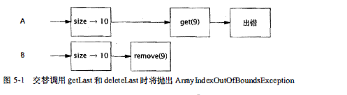

### 同步容器类
#### 常见的同步容器
- ArrayList -> Vecotr
- HashMap -> Hashtable
- Collections.synchronizedXXX

#### 同步容器并不是在任何情况下都能线程安全
- 导致混乱结果的符合操作
```java
    public static Object getLast(Vector list) {
        int lastIndex = list.siaze() - 1;
        return list.get(lastIndex);
    }

    public static void deleteLast(Vector list) {
        int lastIndex = list.siaze() - 1;
        list.remove(lastIndex);
    }
```

> 如果线程A 在包含10 个元素的Vector 上调用getLast, 同时线程B 在同一个Vector 上调用deleteLast, 这些操作的交替执行如图所示， getLast 将抛出ArraylndexOutOffioundsException 异常。在调用size与调用getLast 这两个操作之间， Vector 变小了， 因此在调用size 时得到的索引值将不再有效。这种情况很好地遵循了Vector 的规范一一如果请求一个不存在的元素， 那么将抛出一个异常


解决方法：在容器上加锁
```java
    public static Object getLast(Vector list) {
        synchronized(list) {
            int lastIndex = list.siaze() - 1;
            return list.get(lastIndex);
        }
    }
```

- 迭代操作抛出ArrayIndexOutOfBoundsException异常
```java
    for (int i = 0; i < vector.size(); i++) {
        doSomething(vector.get(i));
    }
```
> 如果在对Vector进行迭代时， 另一个线程删除了一个元素， 并且这两个操作交替执行， 那么这种迭
代方法将抛出ArrayindexOutOfBoundsException异常。
解决方法：在容器上加锁
```java
    synchronized(vector) {
        for (int i = 0; i < vector.size(); i++) {
        doSomething(vector.get(i));
        }
    }
```

- 迭代器与ConcurrentModificationException
无论在直接迭代还是在Java5.0引入的for-each循环语法中，对容器类进行迭代的标准方式都是使用Iterator, 然而， 如果有其他线程并发地修改容器， 那么即使是使用迭代器也无法避免在迭代期间对容器加锁。在设计同步容器类的迭代器时并没有考虑到并发修改的问题， 并且它们表现出的行为是“ 及时失败" (fail-fast)的。这种“ 及时失败” 的迭代器井不是一种完备的处理机制，而只是“ 善意地” 捕获并发错误，因此只能作为并发问题的预警指示器。它们采用的实现方式是，将计数器的变化与容器关联起来： 如果在迭代期间计数器被修改， 那么hasNext或next将抛出ConcurrentModificationException。

```java
    List<Widget> widgetList = Collections.synchronizedList(new ArrayList<Wedget>);
    for (Widget w : widgetList) {
        doSomething(w);
    }
```
解决方法：
1. 可以通过持有容器的锁来避免出现这个异常
2. 如果不希望在迭代期间对容器加锁， 那么一种替代方法就是“ 克隆” 容器， 并在副本上进行迭代。
> 在遍历容器的过程中(不管是不是线程安全的容器），特别是使用foreach和iterator时，尽量不要对容器进行删除等更新操作，可以遍历过程中做好标记，等遍历结束后再进行处理.

- 隐藏迭代器

```java
public class HiddenIterator {
    @GuardedBy("this") private final Set<Integer> set = new HashSet<Integer>();
    public synchronized void add(Integer i) {
        set.add(i);
    }

    public synchronized void remove(Integer i) {
        set.remove(i);
    }

    public void addTenThings() {
        Random r = new Random();
        for (int i = 0; i < 10; i++)
            add(r.nextInt());
        System.out.println("DEBUG: added ten elements to " + set);
    }
}
```
addTenThings方法可能会抛出ConcurrentModificationException, 因为在生成调试消息的过程中， toString 对容器进行迭代。

> 容器的hashCode和equals等方法也会间接地执行迭代操作，当容器作为另一个容器的元素或键值时，就会出现这种情况。同样， containsAll、removeAll 和retainAll 等方法，以及把容器作为参数的构造函数，都会对容器进行迭代。所有这些间接的迭代操作都可能抛出ConcurrentModificationException。

----


### 并发容器
并发容器是针对多个线程并发访问设计的,Java5.0提供了多种并发容器类来改进同步容器的性能,通过并发容器来代替同步容器，可以极大地提高伸缩性并降低风险。
#### 常见并发容器
- ArrayList -> CopyOnWriteArrayList
- HashSet、TreeSet -> CopyOnWriteArraySet、ConcurrentSkipListSet
- HashMap、TreeMap -> ConcurrentHashMap、ConcurrentSkipListMap

#### ConcurrentHashMap
- ConcurrentHashMap并不是想同步容器那样对容器加独占锁进行访问，它采用分段锁机制：任意数量的读取线程可以并发地访问Map, 执行读取操作的线程和执行写入操作的线程可以并发地访问Map, 并且一定数量的写入线程可以并发地修改Map。
- ConcurrentHashMap不能被加锁来执行独占访问，所以当需要使用客户端加锁新建新的原子操作时，可以通过实现ConcurrentMap来实现
- ConcurrentHashMap与其他并发容器迭代器的弱一致性：它们提供的迭代器不会抛出ConcurrentModificationException, 因此不需要在迭代过程中对容器加锁。ConcurrentHashMap返回的迭代器具有弱一致性(Weakly Consistent), 而并非“ 及时失败"。弱一致性的迭代器可以容忍并发的修改，当创建迭代器时会遍历已有的元素， 并可以（但是不保证） 在迭代器被构造后将修改操作反映给容器。

#### CopyOnWriteArrayList
- 写入时复制：CopyOnWriteArrayList,线程安全，当对CopyOnWriteArrayList进行写操作时，现将原来的数组拷贝一份，然后在新的数组里面进行写操作，写完之后再将原来的数组指向新的数组，读操作时不需要加锁，写操作时需要加锁；
- CopyOnWriteArrayList的缺点：
1.拷贝的时候会消耗内存，当元素个数太多时，可能会导致Minor GC或者Full GC
2.没办法满足实时读的要求，复制和新增元素都需要时间，他只能满足最终的一致性，适合于读多写少的场景

> 仅当迭代操作远远多于修改操作时， 才应该使用 “ 写入时复制” 容器。

----
### 阻塞队列
#### 常见阻塞队列
- ArrayBlockingQueue：有界，初始化时指定大小，内部是一个数组
- DelayQueue: 无界，内部元素必须实现Delayed接口，Delayed接口继承了Comparable接口，内部是PriorityBlockingQueue和lock，其中的对象只能在其到期时才能从队列中取走
- LinkedBlockingQueue: 大小配置可选，初始化指定大小则是有边界，没有指定则无大小，内部是链表
- PriorityBlockingQueue: 带优先级，没有边界，有排序规则，可以插入null,元素必须实现Comparable接口
- SynchronousQueue: 内部仅允许容纳一个元素，当一个线程插入一个元素就会被阻塞，除非这个元素被其他线程消费

#### 串行封闭
- 对于可变对象， 生产者 － 消费者这种设计与阻塞队列一起， 促进了串行线程封闭， 从而将对象所有权从生产者交付给消费者。 线程封闭对象只能由单个线程拥有， 但可以通过安全地发布该对象来 “转移 ” 所有权。在转移所有权后， 也只有另一个线程能获得这个对象的访问权限，并且发布对象的线程不会再访问它。这种安全的发布确保了对象状态对于新的所有者来说是可见的， 并且由于最初的所有者不会再访问它， 因此对象将被封闭在新的线程中。 新的所有者线程可以对该对象做任意修改， 因为它具有独占的访问权。
- 对象池利用了串行线程封闭， 将对象“借给“一个请求线程。只要对象池包含足够的内部同步来安全地发布池中的对象， 并且只要客户代码本身不会发布池中的对象， 或者在将对象返回给对象池后就不再使用它， 那么就可以安全地在线程之间传递所有权。

#### 双端队列与工作密取
- 双端队列：Deque 是一个双端队列， 实现了在队列头和队列尾的高效插入和移除。 具体实现包括 ArrayDeque 和 LinkedBlockingDeque。
- 工作密取： 在生产者－消费者设计中，所有消费者有一个共享的工作队列， 而在 工作密取设计中， 每个消费者都有各自的双端队列。 如果一个消费者完成了自己双端队列中的 全部工作， 那么它可以从其他消费者双端队列末尾秘密地获取工作。

----

### 同步工具类
#### 闭锁CountDownLatch
 闭锁的作用相当于一扇门：在闭锁到达结束状态之前， 这扇门 一直是关闭的，并且没有任何线程能通过，当到达结束状态时，这扇门会打开并允许所有的线程通过。 当闭锁到达结束状态后将不会再改变状态，因此这扇门将永远保持打开状态。

 示例：通过CountDownLatch来启动和停止线程
 ```java
 public class TestHarness {
    public long timeTasks(int nThreads, final Runnable task)
            throws InterruptedException {
        final CountDownLatch startGate = new CountDownLatch(1);
        final CountDownLatch endGate = new CountDownLatch(nThreads);

        for (int i = 0; i < nThreads; i++) {
            Thread t = new Thread() {
                public void run() {
                    try {
                        startGate.await();
                        try {
                            task.run();
                        } finally {
                            endGate.countDown();
                        }
                    } catch (InterruptedException ignored) {
                    }
                }
            };
            t.start();
        }

        long start = System.nanoTime();
        startGate.countDown();
        endGate.await();
        long end = System.nanoTime();
        return end - start;
    }
}
 ```
 > TestHarness创建一定数量的线程， 利用它们井发地执行指定的任务。 它使用两个闭锁， 分别表示 “起始门(Starting Gate)"和 “结束门(Ending Gate) "。 起始门计数器的初始值为 1, 而结束门计数器的初始值为工作线程的数量。 每个工作线程首先要做的值就是在启动门上等待， 从而确保所有线程都就绪 后才开始执行。 
#### 栅栏CyclicBarrier、Exchanger
- 栅栏类似于闭锁， 它能阻塞一组线程直到某个事件发生。
- 


#### CountDownLatch与CyclicBarrier的区别
- 栅栏与闭锁的关键区别在于， 所有线程必须同时到达栅栏位置， 才能继续执行。闭锁用于等待事件， 而栅栏用于等待其他线程。
#### 信号量Semaphore
#### Callable和Future
#### FutureTask
#### Fork/Join框架
----
### 阻塞方法与中断方法