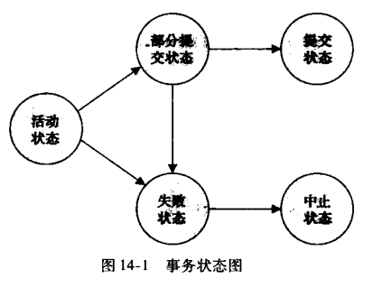

### 事务的ACID特性

- **原子性**: 事务的所有操作在数据库中要么全部正确反映出来，要么完全不反映。

- **一致性**: 隔离执行事务时（即不考虑其他事务并发执行）保持数据库的一致性。 在数据库系统中由恢复系统负责。

- **隔离性**: 尽管多个事务可能并发执行，但系统保证对于多个事务，如T1和T2，对于T1来说，T1要么在T2开始之前已经完成执行，要么在T2完成之后开始执行。确保隔离性在数据库系统中由并发控制系统部件负责。

- **持久性**: 一旦事务成功完成后，它对数据库的更新必须是永久的，即使出现系统故障，在数据库系统中由恢复系统负责。 可以通过一下两条中的其中任何一条来确保持久性。
1. 事务做的更新在事务结束前已经给写入磁盘
2. 有关事务已执行的更新信息已写到磁盘上，并且此类信息必须充分，能让数据库在系统出现故障后重新启动时重新构造更新

----

### 事务原子性和持久性
#### 五种状态
可以为事务建立一个简单的抽象事务类型，分为五种状态，事务必须处于以下状态之一
- **活动的**： 初始状态，事务正在执行时处于此状态
- **部分提交的**： 最后一条语句执行后
- **失败的**： 发现正常的执行不能继续后
- **中止的**： 事务回滚并且数据库已恢复到事务开始执行前的状态后
- **提交的**： 成功完成后

#### 中止状态事务回滚的两种选择

- **重启事务**，但仅当引起事务中止的是硬件错误而不是有事务内部逻辑所产生的软件错误。
- **杀死事务**, 这样做通常是由于事务内部逻辑造成的错误，只有重写应用程序才能改正

----

### 事务隔离性
#### 可串行化调度
- **冲突**: 假设I和J是不同事务在在相同数据项上的操作，并且其中至少有一个是write指令时，I与J是冲突的
- **冲突等价**: 调度S经过一系列非冲突指令交换转换成S'，S与S'冲突等价
- **冲突可串行化**: 一个调度S与另一个串行调度冲突等价，则称调度S是冲突可串行化的

#### 可恢复性
- **可恢复调度**: 对于每对事务T1和T2，如果T2读取了之前由T1所写的数据项，则T1先于T2提交
- **无级联调度**: 对于每对事务T1和T2，如果T2读取了之前由T1所写的数据项，则T1必须在T2这一读操作前提交

#### 事务隔离性级别
- **可串行化**: 通常保证可串行化调度
- **可重复读**: 只允许读取已提交的数据，而且在一个事务两次读取一个数据项期间，其他事务不得更新该数据，但该事务不要求与其他事务可串行化
- **已提交读**: 只允许读取已提交数据，但不要求可重复读功能
- **未提交读**: 允许读未提交数据

----

### 并发控制
#### 基于锁的协议
##### 锁
- **共享锁（S)**: 如果事务T1获得了数据项Q上的共享型锁（记为S），则T1可读但不能写
- **排他锁(X)**: 如果事务T1获得了数据项Q上的排他型锁（记为X），则T1既可读又可写Q
- **相容的锁**: 数据项Q上存在B类型锁，如果事务T可以立即获得数据项Q上的A类型锁，则说A类型锁与B类型锁是相容的，即comp(A,B)=true

##### 锁的授予
- **避免饿死**: 可以通过在数据项Q上加M型锁，加锁条件如下：
    1.不存在在数据项Q上持有与M型锁冲突的锁的事务
    2.不存在等待对数据项Q上先于T申请枷锁的事务

##### 两阶段封锁协议
- **增长阶段**: 事务可以获得锁，但不能释放锁
- **缩减阶段**: 事务可以释放锁，但不能获得新锁
- **严格两阶段封锁协议**: 事务持有的所有排他锁必须在事务提交后方可释放
- **强两阶段封锁协议**: 事务提交之前不得释放任何锁

##### 多粒度
- **多级粒度机制**: 通过允许各种大小的数据项并定义数据粒度的层次结构，其中小粒度数据项嵌套在大力度数据项中来实现。这种层次结构可以图形化地表示为树
- **意向锁**: 如果一个结点佳航了意向锁，则意味着要在树的叫底层进行显式加锁，在一个结点显式加锁前，该结点的的全部祖先结点都加上了意向锁。 这样子可以避免了需要从头遍历结点才能发现子结点已经加锁
- **共享意向锁(IS)**: 一个结点加上了共享意向锁，树的较低层进行显式封锁，但只能加共享锁。
- **排他意向锁(IX)**: 一个结点加上了排他意向锁，树的较低层进行显式封锁，可以加共享锁或排他锁。
- **共享排他意向锁(SIX)**: 一个结点加上了共享排他意向锁，则以该结点为根的子树显式地加上了共享锁，并且将在数的更低层显式地加排他锁。
- **各种锁类型相容函数**：

#### 基于时间戳的协议
对于系统中的每个事务T，把一个唯一的固定时间戳与他联系起来，此时间戳记为TS(T)。该时间戳是在事务T开始执行前由数据库系统赋予的。实现这种机制可以用以下两种方法：
- 使用系统始终的值作为时间戳，即事务的时间戳等于该事务进入系统时的时钟值。
- 使用逻辑计数器，没赋予一个时间戳，计数器增加计数，即事务的时间戳等于该事务进入系统时的计数器值。

每个数据项需要与两个时间戳相关联：
- W-timestamp（Q）表示成功执行write（Q）的所有事务的最大时间戳
- R-timestamp（Q）表示成功执行read（Q）的所有事务的最大时间戳

协议运作方式如下：
1.假设事务T发出read（Q）
&emsp; a.若TS（T）< W-timestamp（Q），则T需要读入的Q值已被覆盖。因此read操作被拒绝，T回滚；
&emsp; b.若TS（T）>= W-timestamp（Q），则执行read操作，R-timestamp（Q）被设置为R-timestamp（Q）与TS(T)两者的最大值
2.假设事务T发出write（Q）
&emsp; a.若TS（T）< R-timestamp（Q），则T产生的Q值是先前所需要的值，且系统已假定该值不会在产生，因此write被拒绝，T回滚
&emsp; b.若TS（T）< W-timestamp（Q），则T试图写入的Q值已过时，write操作被拒绝，T回滚
&emsp; c.其他情况，系统执行write操作，将W-timestamp（Q）设置为TS（T）。

