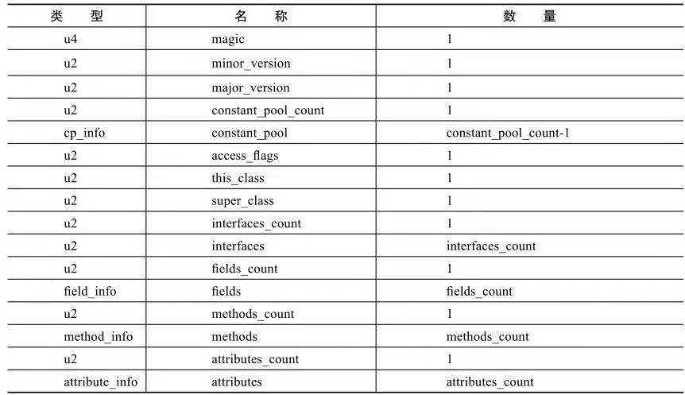
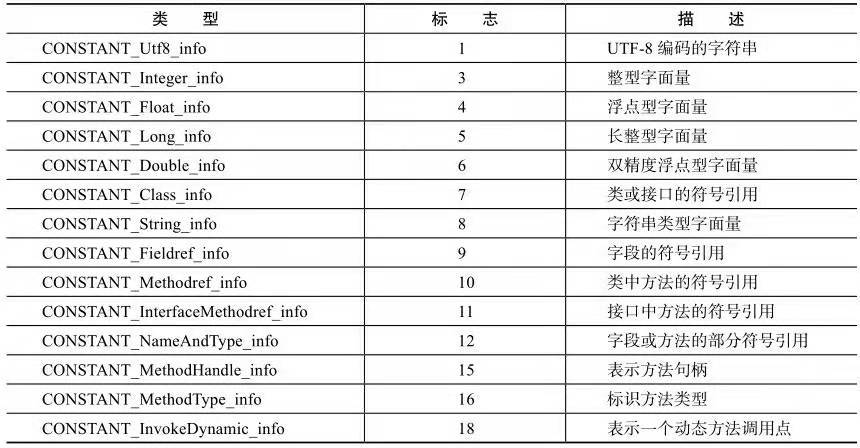

> Class文件十一组以8位字节为基础单位的二进制流，各个数据项目严格按照顺序紧凑地排列在Class文件之中，当遇到需要占用8位字节以上的空间的数据项时，按照 **高位在前(最高位字节在地址最低位)**的方式分割成若干个8为字节进行存储

Class文件格式：

### 1. 魔数与Class文件的版本
- 每个Class文件的头4个字节称为魔数，它的唯一作用是确定这个文件是否为一个能被虚拟机接收的Class文件（很多文件存储标准都是用魔数来进行身份识别，譬如图片格式等）
- 紧接着魔数的4个字节存储的是Class文件的版本号：第5和第6个字节是次版本号，第7和第8个字节是主版本号，高版本的JDK能向下兼容以前版本的Class文件，但不能运行以后版本的Class文件

### 2. 常量池
- 紧接着主次版本号之后的是常量池入口，常量池可以 理解为Class文件之中的资源仓库，常量池的入口需要放置一项u2类型的数据，代表常量池容量计数值，这个计数值从1开始
- 常量池中主要存放两大类常量：字面量和符号引用：
    - 字面量：比较接近于Java语言层面的常量概念
    - 符号引用：属于编译原理方面的概念，包括了下面三类常量：
        - 类和接口的全限定名
        - 字段的名称和描述符
        - 方法的名称和描述符
- 常量池中每一项常量都是一个表，每个表开始的第一位都是一个u1类型的标志位，代表 当前这个常量属于那种类型常量

常量池的项目类型：
