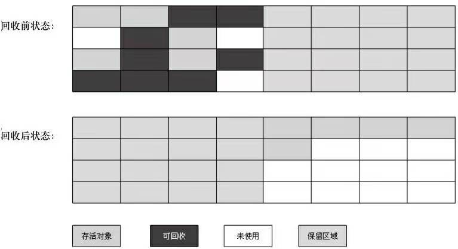
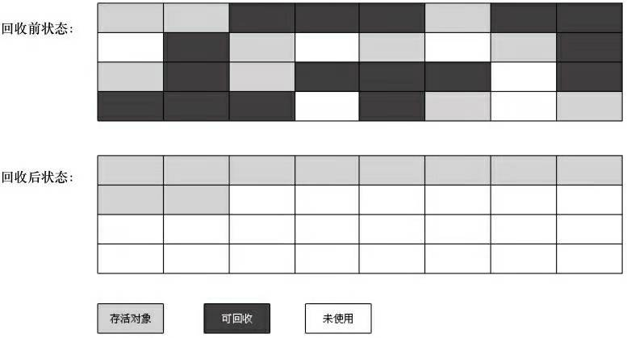

### 对象存活判断算法
#### 引用计数算法
给对象添加一个引用计数器，有一个地方引用它计数值就加1，引用失效时减1，任何时刻计数器为0则不可能再被使用
> 实现简单，判定效率高，但很难解决对象之间相互循环引用的问题，主流Java虚拟机没有选用这种方式管理内存

#### 可达性分析算法
通过一系列的称为"GC Roots"的对象作为起始点，从这些节点开始向下搜索，搜索所走过 的路径称为引用链，当一个对象到GC Roots没有任何引用链时，证明此对象是不可用的
> Java中扩展为GC Roots的对象包括以下几种 ：
- 虚拟机栈中引用的对象
- 方法区中类静态属性引用的对象
- 方法区中常量引用的对象
- 本地方法栈中JNI（即一般说的Native方法）引用的对象

#### 对象死亡的判定
真正宣告一个对象死亡，至少要经理两次标记过程：
1. 在进行可达性分析后发现不可达，将会被第一次标记并且进行一次筛选
> 当对象没有覆盖finalize()方法，或者finalize()方法已经被虚拟机调用过，视为“没有必要执行finalize”的情况，若有必要执行finalize，则将对象放入F-Queue的队列之中，并稍后由虚拟机自动建立的、低优先级的Finalizer线程去执行。（一个对象的finalize()方法只会被系统调用一次）

2. GC对F-Queue中的对象进行第二次标记
> 对象逃脱的唯一机会就在finalize()方法中，只要重新与引用链上的任何一个对象建立关联即可

#### 回收方法区（即HotSpot中的永久代）
> 永久代的垃圾主要回收两部分的内容：废弃常量和无用的类。

"无用的类"需要满足的三个条件：
1. 该类所有的实例都已经被回收，也就是Java堆中不存在该类的任何实例
2. 加载该类的ClassLoader已经被回收
3. 该类对应的java.class.Class对象没有在任何地方被引用

### 垃圾收集算法
#### 标记-清除算法
- **标记阶段**: 标记所有需要回收的对象
- **清除阶段**: 统一回收所有被标记的对象

两个不足：
- **效率问题**，标记和清除的效率都不高
- **空间问题**，标记清除之后产生大量不连续的碎片
#### 复制算法
> 将可用内存按**容量**划分为大小相等的凉快，每次之使用给一块。当这一块的内存用完时，就将还存活的对象复制到另外一块上，然后把已使用过的内存空间一次清理掉。

- 现在商业虚拟机用这种算法回收新生代，将内存分为一块 较大的Eden空间和两块较小的Survivor空间，每次使用Eden和其中一块Survivor，回收时将这两块上还存活的对象一次性复制到Survivor上，最后清理掉Eden和Survivor（在HotSpot默认Eden和Survivor的大小比例为8:1）
- 当Survivor内存不够用时，需要依赖其他内存（这里指老年代）进行分配担保

#### 标记-整理算法
> 和“标记-清除算法”一样，但后续步骤是不是直接对可回收对象进行清理，而是 **让所有存活的对象都向一端移动**

#### 分代收集算法
> 把Java堆分为 **新生代**和 **老年代**，这样可以根据各个年代的特点采用最适当的收集算法

- 新生代每次垃圾收集都发现大批对象死去，只有少量存活，选用复制算法
- 老年代对象存活率高、没有额外空间对它进行分配担保，使用“标记清理”或者“标记整理”算法

----
### HotSpot的算法实现
#### 枚举根节点
在HotSpot中，使用OopMap来直接得知哪些地方存放着对象引用，在类加载完成的时候，HotSpot就把对象内什么偏移量上是什么类型的数据计算出来，在JIT编译过程中，也会在特定的位置记录下栈和寄存器中那些未知是应用

#### 安全点
- HotSpot没有为每条指令都生成OopMap，只是在安全点（Safepoint）记录了这些信息
> 即程序执行时并非在所有地方都能停顿下来开始GC，只有在到达安全点时才能暂停

- 当GC发生时让所有线程都跑到最近的安全点上停顿下来的两种方案：
1. 抢先式中断
2. 主动式中断： 当GC需要中断线程的时候，不直接对线程操作，仅仅简单地设置一个标志，各个线程执行时主动去轮询这个标志

#### 安全区域
指正在一段代码片段之中，引用关系不会发生变化，在这个区域中的任意地方开始GC都是安全的。
> 当线程执行到安全区域中的代码时，首先标识自己已经进入了Safe Region，当在这段时间里JVM发起GC时，就不用管标识自己为Safe Region的线程了

----
### 内存分配与回收策略
#### 1. 对象有限在Eden分配
- 大多数情况下，对象在新生代Eden区中分配，当Eden区没有足够空间进行分配时，虚拟机将发起一次Minor GC
- Minor GC期间虚拟机若发现已有的对象无法放入Survivor空间，就通过分配担保机制提前转移到老年代去
- 新生代GC（Minor GC）与老年代GC（Major GC/Full GC）：
    i. 新生代GC：Java对象大多具备朝生夕灭的特性，所以Minor GC非常频繁，一般回收速度也比较快
    ii. 老年代GC：出现了Major GC经常会伴随着至少一次的Minor GC，Major GC的速度一般会比Minor GC慢10倍以上

#### 2. 大对象直接进入老年代
- 大对象是指需要大量连续内存空间的Java对象，最典型的大对象就是那种很长的字符串以及数组
- 虚拟机提供了一个-XX:PretenureSizeThreshold参数，令大于这个设置值的对象直接在老年代分配，目的是避免在Eden区及两个Survivor区之间发送大量的内存复制

#### 3. 长期存活的对象将进入老年代
- 虚拟机给每个对象定义了一个对象年龄计数器
- 如果对象在Eden出生并经过第一次Minor GC后仍然存活，并且能被Survivor容纳的话，将被移动到Survivor空间中，对象年龄设为1
- 对象在Survivor区中每“熬过”一次Minor GC，年龄就增加1岁，当年龄增加到一定程度（可以用过参数-XX：MaxTenuringThreshold设置，默认为15），就将会被晋升到老年代中

#### 4. 动态对象年龄判定
- 虚拟机并不是永远地要求 对象的年龄必须达到了XX：MaxTenuringThreshold才能晋升老年代
- 如果在Survivor空间中相同年龄所有对象大小的总和大于Survivor空间的一半，年龄大于或等于改年龄的对象就可以直接进入老年代

#### 5. 空间分配担保
- 发送Minor GC之前，虚拟机先检查老年代最大可用的连续空间是否大于新生代所有对象总空间，如果条件成立，那么Minor GC可以确保是安全的
- 如果不成立，则虚拟机会查看HandlePromotionFailure设置值是否允许担保失败：
    - 如果允许，那么继续检查老年代最大可用的连续空间是否大于历次晋升到老年代对象的平均大小：
        - 如果大于，将尝试着进行一次Minor GC，尽管这次Minor GC是有风险的；
        - 如果小于，那么这时要改为进行一次Full GC
    - 如果不允许，那么也要改为进行一次Full GC

> JDK6 Update24之后规则变为只要老年代最大可用的连续空间大于新生代总大小或者历次晋升的平均大小就会进行Minor GC，否则进行Full GC。（HandlePromotionFailure仍存在但不起影响）
        

